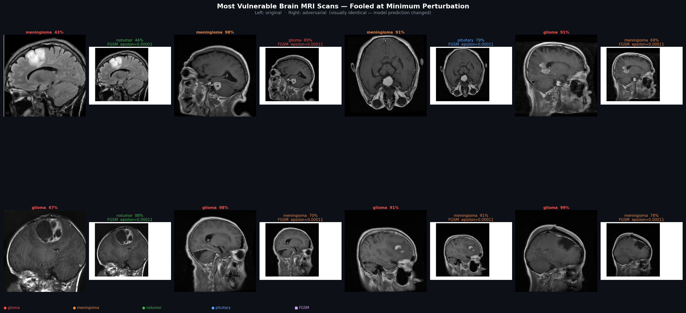

# Adversarial Attack Workbench — Brain Tumor MRI Classifier

A research workbench for generating and analysing adversarial examples against a ResNet50 brain tumor MRI classifier. The tool implements three attack algorithms, three search strategies for finding minimum perturbations, and a gallery renderer for visualising results.

---

## Table of Contents

- [Background](#background)
- [Project Structure](#project-structure)
- [Setup](#setup)
- [Usage](#usage)
- [Attack Methods](#attack-methods)
- [Search Modes](#search-modes)
- [Technical Report](#technical-report)
- [Gallery](#gallery)
- [Citation](#citation)

---

## Background

Deep learning models used in medical imaging are known to be vulnerable to **adversarial examples** — inputs with small, carefully constructed perturbations that are imperceptible to the human eye but cause the model to produce a completely different prediction. This workbench evaluates the robustness of a ResNet50 classifier trained to detect brain tumors across four classes:

| Class | Description |
|---|---|
| `glioma` | Malignant brain tumor arising from glial cells |
| `meningioma` | Tumor of the meninges, often benign |
| `notumor` | Healthy brain scan with no detectable tumor |
| `pituitary` | Tumor of the pituitary gland |

The model was evaluated against **1,600 test images** (400 per class) using three adversarial attack algorithms across three search strategies. The goal is to quantify how close each image sits to the model's decision boundary and to identify which classes and attack types expose the greatest vulnerabilities.

---

## Project Structure

```
adversarial_attacks/
│
├── attacks.py          # Main attack runner — all modes and attacks
├── gallery.py          # Visual gallery renderer for fooled results
├── setup.sh            # One-time environment setup
├── requirements.txt    # Python dependencies
│
├── model/
│   └── resnet50_brain_tumor.torchscript.pt   # TorchScript classifier
│
├── data/
│   ├── glioma/         # 400 test images
│   ├── meningioma/     # 400 test images
│   ├── notumor/        # 400 test images
│   ├── pituitary/      # 400 test images
│   └── samples/        # 4 representative images for quick testing
│
└── results/
    ├── *.png           # Comparison images (original | adversarial | perturbation map)
    └── fooled/         # Subset where the model prediction changed
```

---

## Setup

Run once on a new machine to create the virtual environment and install all dependencies:

```bash
bash setup.sh
source venv/bin/activate
```

---

## Usage

```bash
# Run all attacks on the full dataset (sweep mode — recommended)
python attacks.py --sweep

# Single image, one attack
python attacks.py --image data/samples/pituitary.jpg --attack FGSM --sweep

# Tighter ceiling — only save images fooled at very small perturbations
python attacks.py --sweep --eps-max 0.001

# Binary search mode
python attacks.py --bisect --eps-max 0.005

# Fixed epsilon grid (original mode)
python attacks.py --attack all

# Generate the adversarial gallery from results
python gallery.py --top 16
python gallery.py --top 32 --cols 3
```

**Output**

- `results/` — three-panel comparison PNG for each adversarial example (original | adversarial | perturbation heatmap)
- `results/fooled/` — subset of results where the model prediction changed
- `results/gallery.png` — visual grid of the most vulnerable images

---

## Attack Methods

### FGSM — Fast Gradient Sign Method (L∞)

A single-step attack that computes the gradient of the loss with respect to the input image and perturbs every pixel by ε in the direction that maximises the loss. Fast but relatively weak — the perturbation is not iteratively refined. Controlled by the L∞ norm, meaning no single pixel changes by more than ε.

### PGD — Projected Gradient Descent (L∞)

An iterative extension of FGSM. The attack takes multiple small gradient steps and after each step projects the perturbed image back into the L∞ ball of radius ε around the original. Significantly more powerful than FGSM because it can navigate around local optima in the loss landscape.

### DeepFool (L2)

An iterative attack that finds the **minimum L2 perturbation** needed to move the image across the nearest decision boundary. Rather than using a fixed ε budget, it analytically estimates the distance to the boundary at each step and halts as soon as a misclassification occurs. Used here to measure the true geometric proximity of each image to the decision boundary.

---

## Search Modes

### Fixed ε (default)

Runs each attack at a fixed set of epsilon values: `[0.01, 0.03, 0.05]` for L∞ attacks and `[0.5, 1.0, 2.0]` for DeepFool. Both fooled and non-fooled results are saved as comparison images.

### Bisect (`--bisect`)

For each image, first checks whether `eps_max` fools the model. If it does, binary search is used to find the minimum fooling ε within `(0, eps_max]`, halving the interval up to 20 times (precision ≈ 1e-4). More efficient than sweep for finding minimums when a known upper bound exists.

### Sweep (`--sweep`)

Starts at `eps_start` (default 1e-5) and steps upward by `eps_step` (default 1e-4), passing all candidate epsilons to Foolbox in a single call. Returns the first epsilon at which the model is fooled. Images that are not fooled within `eps_max` are not saved. This is the recommended mode for identifying genuinely fragile images without inflating results with forced misclassifications.

| Flag | Default | Description |
|---|---|---|
| `--eps-start` | `0.00001` | Starting epsilon for sweep |
| `--eps-step` | `0.0001` | Step size between candidates |
| `--eps-max` | `0.005` | Ceiling — images requiring more are skipped |

---

## Technical Report

### Experimental Setup

- **Model:** ResNet50 fine-tuned on the brain tumor MRI dataset, exported as TorchScript
- **Dataset:** 1,600 test images across 4 classes (400 per class)
- **Attacks:** FGSM, PGD (both L∞), DeepFool (L2)
- **Primary mode:** Bisect search with `eps_max = 0.05` to find the minimum fooling ε per image
- **Hardware:** Apple M-series GPU (MPS backend)

---

### Finding 1 — The model is not adversarially robust

Over **55% of images** are misclassified at L∞ perturbations of ε ≤ 0.001 — well below the threshold of human perception (1/255 ≈ 0.004). The table below shows the cumulative fool rate at increasing epsilon ceilings across both L∞ attacks (1,145 FGSM + 1,531 PGD bisect results):

| ε ceiling | FGSM fooled | PGD fooled |
|---|---|---|
| ≤ 0.0001 | 1.9% | 1.5% |
| ≤ 0.0005 | 21.1% | 31.1% |
| ≤ 0.001 | 38.5% | 68.1% |
| ≤ 0.005 | 62.9% | 99.4% |
| ≤ 0.010 | 68.8% | 99.4% |

PGD reaches near-total penetration (99.4%) by ε = 0.005, while FGSM plateaus around 69% — indicating that some images have decision boundaries that are not well-aligned with the gradient sign direction but yield to iterative search.

---

### Finding 2 — Vulnerability is strongly class-dependent

Minimum fooling epsilons measured on representative images from each class:

| Class | FGSM min ε | PGD min ε | Verdict |
|---|---|---|---|
| **pituitary** | 0.00034 | 0.00029 | Most vulnerable — fooled at sub-pixel perturbation |
| **meningioma** | 0.00177 | 0.00059 | Moderately vulnerable |
| **notumor** | > 0.010 | 0.00125 | Mixed — FGSM resistant, PGD succeeds |
| **glioma** | > 0.010 | 0.00787 | Most robust — requires substantial perturbation |

Pituitary is the most fragile class, fooled by both attacks at epsilons smaller than a single intensity step in 8-bit image space. Glioma is the most robust — FGSM fails entirely below ε = 0.01, and PGD requires nearly 30× more perturbation than pituitary.

The epsilon distribution across the full dataset has a natural **inflection at ε ≈ 0.001**: below it the fool rate rises steeply (structurally fragile images close to the boundary), above it the curve flattens (images that require forced perturbation). This inflection is the recommended threshold for distinguishing genuine model vulnerability from trivial adversarial success.

---

### Finding 3 — PGD substantially outperforms FGSM

Across the full bisect run, PGD achieves a **median minimum ε of 0.00078** versus FGSM's **0.00166** — a 2× advantage in perturbation efficiency. PGD succeeds on all four classes; FGSM fails entirely on glioma and notumor at small ε. This demonstrates that the model has incidental single-step resistance on those classes — a consequence of the gradient structure, not a trained defensive property — and offers no real protection against an iterative adversary.

---

### Finding 4 — Misclassification follows consistent class-confusion patterns

Adversarial perturbations do not push images toward random classes. Across all experiments a clear confusion structure emerges:

| True class | Adversarial prediction | Both attacks |
|---|---|---|
| pituitary | meningioma | ✓ |
| meningioma | pituitary | ✓ |
| notumor | pituitary | ✓ (PGD) |
| glioma | notumor | ✓ (PGD) |

The pituitary ↔ meningioma pair is the dominant confusion. The glioma → notumor misclassification is the most clinically dangerous: a malignant tumor being dismissed as a healthy scan. This pattern suggests the model has conflated feature representations between certain class pairs rather than learning fully separable decision boundaries.

---

### Finding 5 — High confidence does not imply robustness

Several images with original model confidence of 99–100% were among the easiest to fool:

| Image | Original confidence | Min ε to fool |
|---|---|---|
| meningioma sample | 100% | 0.00059 (PGD) |
| notumor sample | 100% | 0.00125 (PGD) |
| pituitary sample | 99.6% | 0.00029 (PGD) |

Softmax confidence scores are not a reliable indicator of adversarial robustness and should not be used as a safety signal in clinical deployment.

---

### Recommendation

The model should **not** be used as a standalone diagnostic tool in its current form. Before any clinical deployment the following mitigations should be considered:

1. **Adversarial training** (e.g. PGD-AT) — retrain with adversarial examples in the training loop to move decision boundaries away from natural images
2. **Certified defences** — randomised smoothing or interval-bound propagation to provide provable robustness guarantees
3. **Robustness benchmarking** — report minimum fooling ε distributions alongside standard accuracy metrics in all model evaluations
4. **Ensemble or abstention mechanisms** — flag low-margin predictions for human review rather than producing a single hard classification

---

## Gallery

The gallery below shows the 16 most vulnerable images in the test set — those fooled at the smallest L∞ perturbation by either FGSM or PGD. Left: original scan with true prediction. Right: adversarial scan with the model's changed prediction. The images are visually indistinguishable.



---

## Citation

The dataset used in this project is sourced from the following Kaggle notebook:

> Mohamed, Y. (2024). *Brain Tumor MRI — Accuracy 99%*. Kaggle.
> Retrieved from https://www.kaggle.com/code/yousefmohamed20/brain-tumor-mri-accuracy-99/notebook

**BibTeX**
```bibtex
@misc{mohamed2024braintumormri,
  author    = {Mohamed, Yousef},
  title     = {Brain Tumor MRI — Accuracy 99\%},
  year      = {2024},
  publisher = {Kaggle},
  url       = {https://www.kaggle.com/code/yousefmohamed20/brain-tumor-mri-accuracy-99/notebook}
}
```
